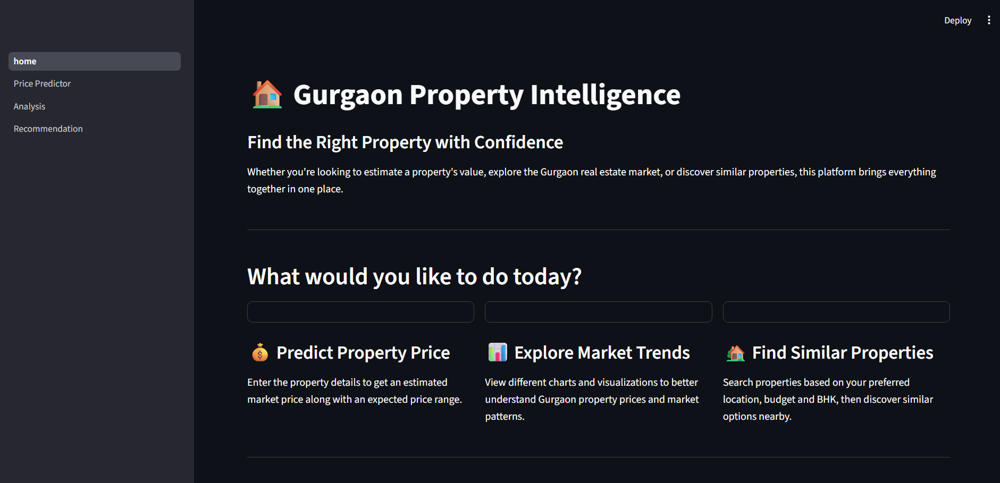
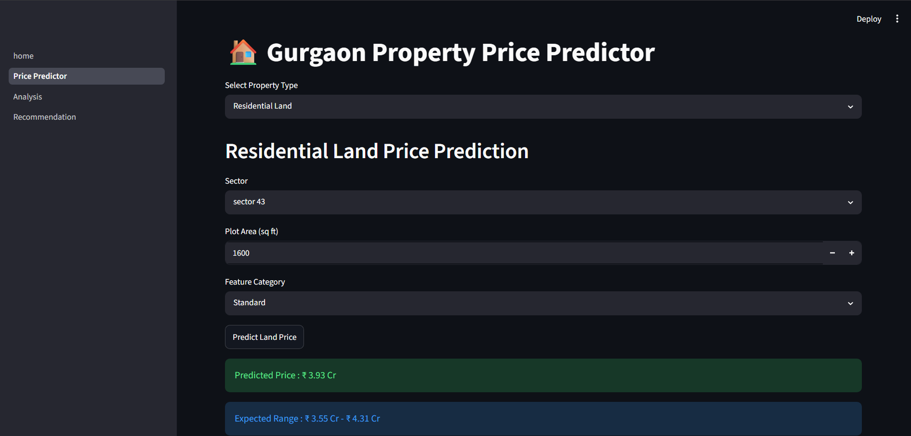
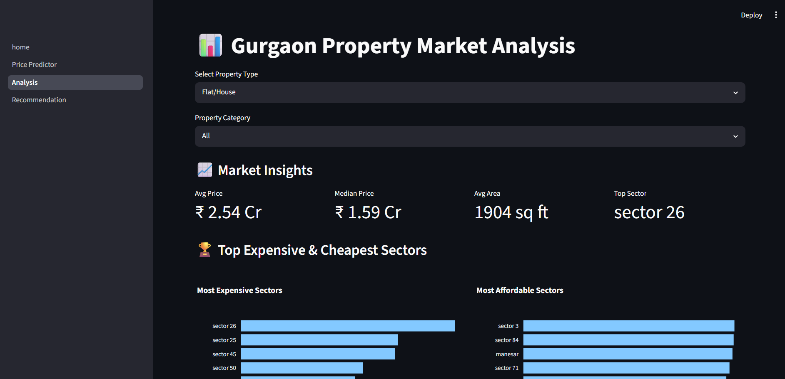
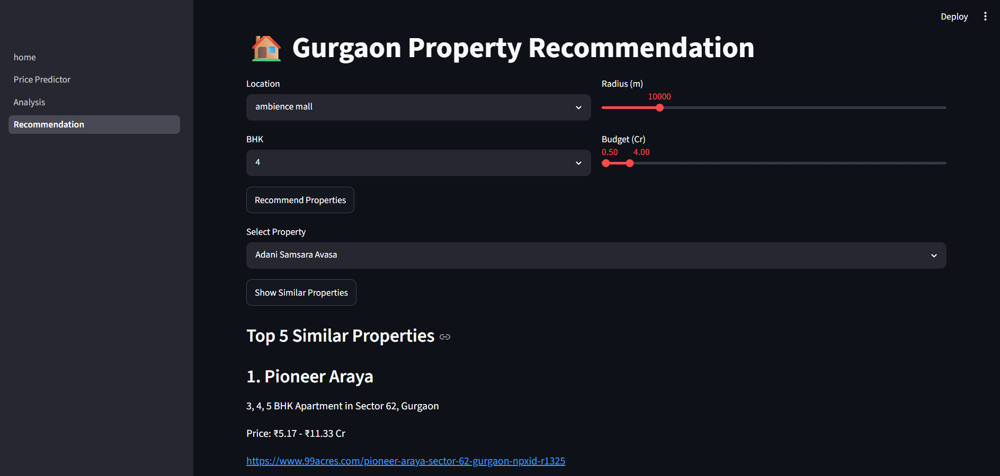

# 🏡 Gurgaon Property Price Prediction

An end-to-end Machine Learning project that predicts residential property prices in Gurgaon using advanced regression models. The application also includes interactive data analysis and a property recommendation system, all deployed using Streamlit.

---

## 🚀 Live Demo

👉 **Streamlit App:**
*(Apna Streamlit URL yaha paste kar dena)*

---

## 📌 Project Overview

This project helps users estimate property prices in Gurgaon based on different property characteristics. The application provides three major modules:

* Property Price Prediction
* Interactive Data Analysis
* Property Recommendation System

The prediction models are trained using cleaned Gurgaon real estate data with extensive feature engineering and machine learning techniques.

---

## ✨ Features

* 🏠 House / Flat Price Prediction
* 🌍 Residential Land Price Prediction
* 📊 Interactive Data Analysis Dashboard
* 💡 Property Recommendation System
* 📈 Beautiful Visualizations using Plotly
* 🌐 Streamlit Web Application

---

## 🛠️ Tech Stack

* Python
* Pandas
* NumPy
* Scikit-Learn
* XGBoost
* Streamlit
* Plotly
* Matplotlib

---

## 📂 Project Structure

```
gurgaon-property-price-prediction/

│
├── cleaned_csv/
├── datasets/
├── notebooks/
├── pages/
├── home.py
├── requirements.txt
└── README.md
```

---

## 📊 Dataset

The dataset contains Gurgaon residential property information including:

* Sector
* Property Type
* Area
* BHK
* Bathrooms
* Features
* Price
* Land Information

The dataset was cleaned, preprocessed, and engineered before model training.

---

## 📸 Application Screenshots

### 🏠 Home Page



---

### 💰 Price Prediction




---

### 📈 Analysis Dashboard




---

### 💡 Recommendation System



---

## ⚙️ Installation

Clone the repository

```bash
git clone https://github.com/loveysandhu/gurgaon-property-price-prediction.git
```

Install dependencies

```bash
pip install -r requirements.txt
```

Run the application

```bash
streamlit run home.py
```

---

## 🔮 Future Improvements

* Google Maps Integration
* Rental Price Prediction
* Deep Learning Models
* Better Recommendation Engine
* More Property Data

---

## 👨‍💻 Author

Lovey Sandhu
